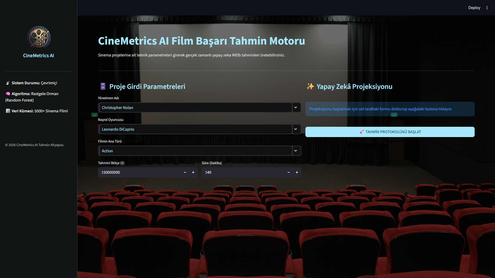
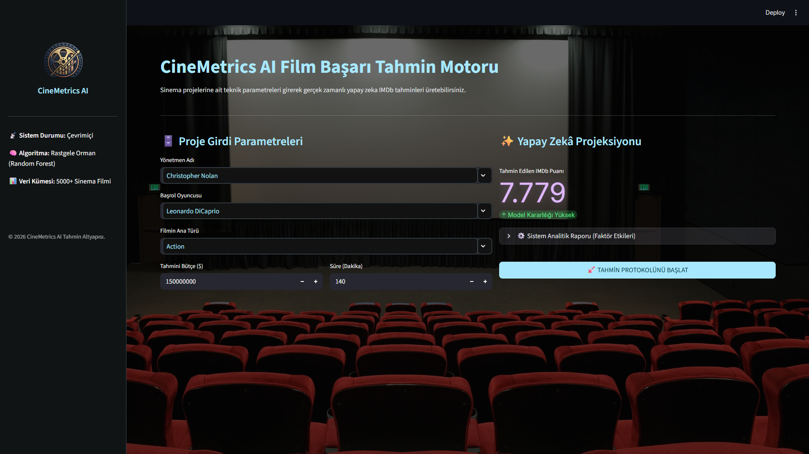

# 🎬 CineMetrics AI: Yapay Zeka Tabanlı Film Başarı Tahmin Sistemi


## 📌 Proje Özeti
CineMetrics AI, sinema projelerinin henüz vizyona girmeden elde edeceği potansiyel IMDb puanını yüksek doğrulukla tahmin etmek için geliştirilmiş uçtan uca  bir makine öğrenmesi web uygulamasıdır. TMDB veri setinden alınan 5000'den fazla sinema filmi kullanılarak eğitilen model; film yapımcıları, prodüksiyon şirketleri ve yatırımcılar için veri odaklı bir risk analizi sunar.

## 📸 Uygulama Arayüzü
*Sistemin karanlık temalı modern web arayüzü ve yapay zeka analiz raporu:*





## 🚀 Öne Çıkan Özellikler ve Mimari
* **Gelişmiş Algoritma (Random Forest Regressor):** Sinema başarısı gibi doğrusal olmayan sanatsal verileri öğrenebilmek için çoklu Karar Ağaçları mimarisi kullanılmıştır.
* **Özellik Mühendisliği (Feature Engineering):** Ham veri setinde yer alan metinsel (string) yönetmen ve oyuncu isimleri, geçmiş başarı ortalamaları hesaplanarak algoritmaya matematiksel ağırlıklar (`float`) olarak entegre edilmiştir. Başarının büyük bütçelerde değil, yetenekte yattığı model tarafından başarılı bir şekilde tespit edilmiştir.
* **Dinamik Hata ve İstisna Yönetimi:** Arayüz üzerinden sisteme, eğitim veri setinde bulunmayan yepyeni bir yönetmen veya oyuncu ismi girildiğinde sistem asla çökmez. Bilinmeyen girdiler için otomatik olarak sektör taban puanı (6.40) atanarak kesintisiz projeksiyon üretilir.
* **Modern Arayüz (UI):** Streamlit altyapısı kullanılarak son kullanıcı için kokpit hissi veren, şık ve interaktif bir web arayüzü inşa edilmiştir.

## 💻 Kurulum ve Çalıştırma
Projeyi kendi yerel ortamınızda (localhost) test etmek için aşağıdaki adımları sırasıyla terminalinize giriniz:

1. Depoyu klonlayın:
   ```bash
   git clone [https://github.com/EgeNegir/CineMetrics-AI.git](https://github.com/EgeNegir/CineMetrics-AI.git)
   cd CineMetrics-AI